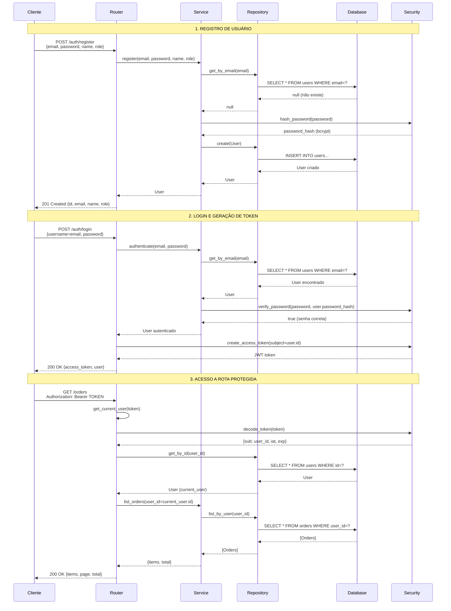
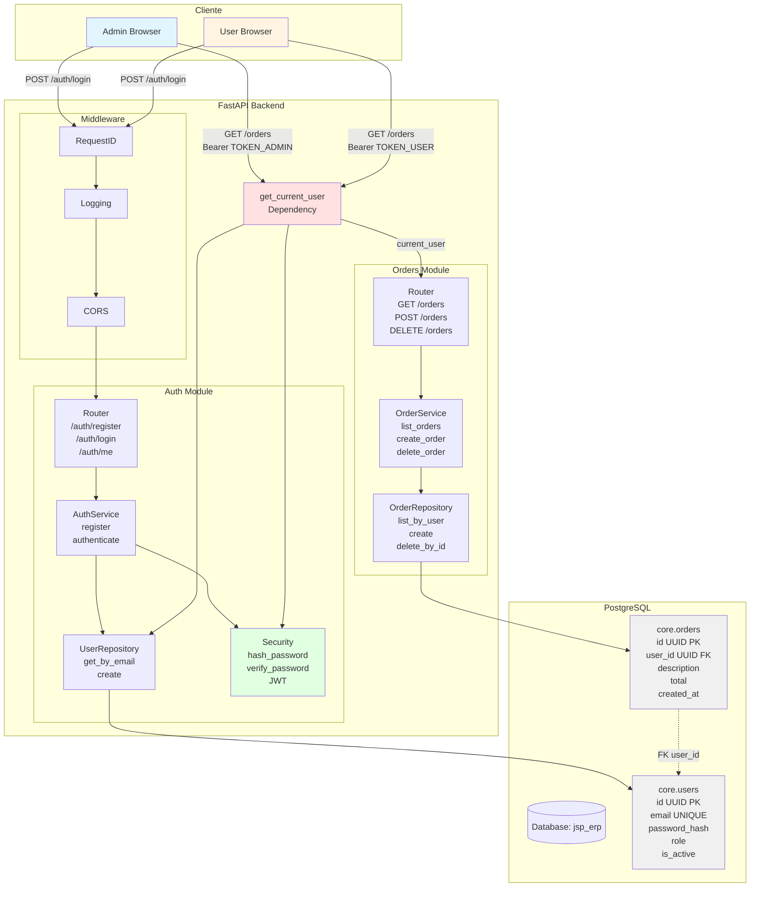
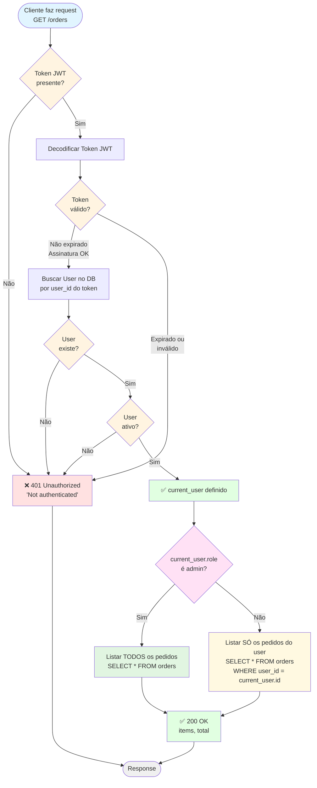
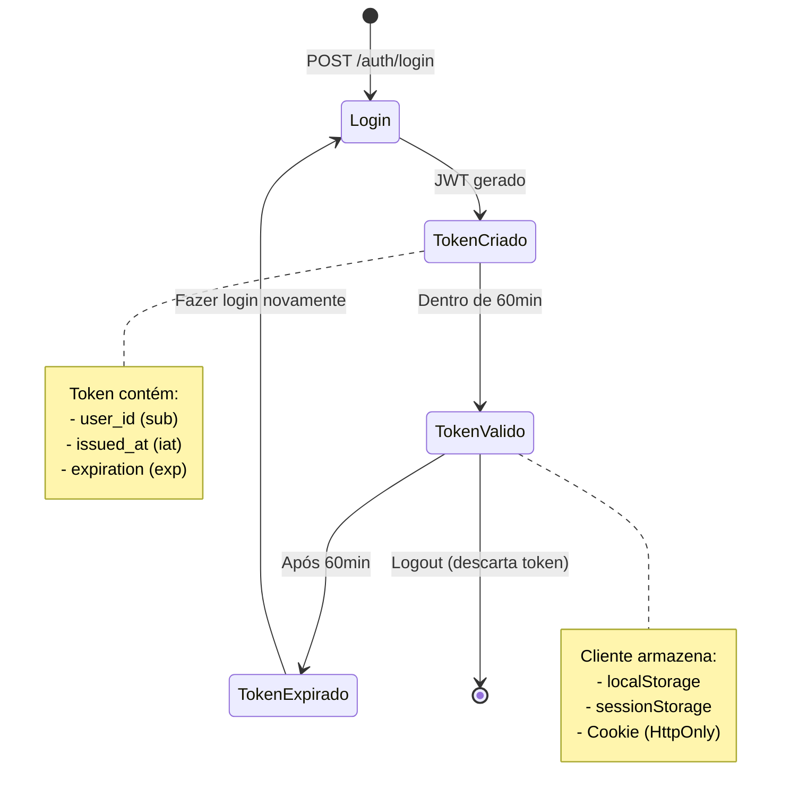

# 🎨 DIAGRAMAS VISUAIS - ETAPA 2

## 📊 Visão Geral da Implementação

Este documento contém diagramas visuais para facilitar o entendimento da arquitetura de autenticação e multi-tenant implementada na ETAPA 2.

---

## 🔄 Fluxo de Autenticação (Sequence Diagram)

### Sequência completa: Registro → Login → Acesso Protegido



**Legenda:**
- **1. Registro**: Senha é hasheada com bcrypt antes de salvar
- **2. Login**: Verifica senha e retorna JWT com 60min de validade
- **3. Acesso**: Token é validado e user_id extraído para filtrar dados

---

## 🏗️ Arquitetura Multi-tenant (Component Diagram)

### Visão completa dos componentes e suas interações



**Componentes principais:**
- **get_current_user**: Dependency que valida token e injeta usuário autenticado
- **Security**: Módulo centralizado de criptografia (bcrypt) e JWT
- **Repositories**: Camada de acesso a dados (isolamento SQL)
- **Services**: Lógica de negócio e validações
- **Routers**: Controllers HTTP (FastAPI)

---

## 🔐 Fluxo Multi-tenant (Flowchart)

### Decisão de autorização e filtro de dados por role



**Pontos de validação:**
1. Token presente no header?
2. Token válido (não expirado, assinatura OK)?
3. User existe no banco?
4. User está ativo?
5. Role determina filtro de dados

---

## 📊 Matriz de Permissões

### Controle de acesso por role

| Operação | Endpoint | Admin | User | Technician | Finance |
|----------|----------|-------|------|------------|---------|
| **Autenticação** |
| Registrar | `POST /auth/register` | ✅ | ✅ | ✅ | ✅ |
| Login | `POST /auth/login` | ✅ | ✅ | ✅ | ✅ |
| Ver perfil | `GET /auth/me` | ✅ | ✅ | ✅ | ✅ |
| **Pedidos - Leitura** |
| Listar pedidos | `GET /orders` | 🌐 Todos | 🔒 Só seus | 🔒 Só seus | 🔒 Só seus |
| Ver pedido específico | `GET /orders/{id}` | ✅ Qualquer | 🔒 Só seus | 🔒 Só seus | 🔒 Só seus |
| **Pedidos - Escrita** |
| Criar pedido | `POST /orders` | ✅ | ✅ | ✅ | ✅ |
| Atualizar pedido | `PUT /orders/{id}` | ✅ Qualquer | 🔒 Só seus | 🔒 Só seus | 🔒 Só seus |
| Deletar pedido | `DELETE /orders/{id}` | ✅ Qualquer | 🔒 Só seus | 🔒 Só seus | 🔒 Só seus |

**Legenda:**
- ✅ = Acesso total
- 🌐 = Vê todos os registros
- 🔒 = Vê/modifica apenas registros próprios (user_id = current_user.id)

---

## 🔑 Estrutura do Token JWT

### Payload decodificado

```json
{
  "sub": "550e8400-e29b-41d4-a716-446655440000",  // user.id (UUID)
  "iat": 1676476800,                               // Issued At (timestamp)
  "exp": 1676480400                                // Expiration (timestamp)
}
```

**Validações realizadas:**
1. Assinatura HMAC-SHA256 com SECRET_KEY
2. Expiração (exp > now)
3. User existe no banco (sub = user.id)
4. User está ativo (is_active = true)

---

## 🗄️ Modelo de Dados (ER Diagram)

```
┌─────────────────────────┐
│      core.users         │
├─────────────────────────┤
│ 🔑 id (UUID)            │
│    name (VARCHAR)       │
│    email (VARCHAR) UK   │
│    password_hash (TEXT) │
│    role (VARCHAR)       │
│    is_active (BOOLEAN)  │
│    created_at (TIMESTAMP)│
└──────────┬──────────────┘
           │
           │ 1:N
           │
           ▼
┌─────────────────────────┐
│     core.orders         │
├─────────────────────────┤
│ 🔑 id (UUID)            │
│ 🔗 user_id (UUID) FK    │
│    description (TEXT)   │
│    total (NUMERIC)      │
│    created_at (TIMESTAMP)│
└─────────────────────────┘
```

**Constraints:**
- `users.email` - UNIQUE
- `users.role` - CHECK IN ('admin', 'user', 'technician', 'finance')
- `orders.user_id` - FK REFERENCES users(id) ON DELETE CASCADE

---

## 🔄 Ciclo de Vida do Token



**Melhorias futuras (ETAPA 3):**
- Refresh tokens (renovar sem relogin)
- Blacklist de tokens revogados
- Múltiplas sessões simultâneas

---

## 🛡️ Camadas de Segurança

```
┌─────────────────────────────────────────┐
│          1. TRANSPORTE (HTTPS)          │ ← Produção
├─────────────────────────────────────────┤
│      2. CORS / Rate Limiting            │ ← FastAPI Middleware
├─────────────────────────────────────────┤
│   3. AUTENTICAÇÃO (JWT + Bcrypt)        │ ← Esta implementação
├─────────────────────────────────────────┤
│  4. AUTORIZAÇÃO (Multi-tenant + Roles)  │ ← Esta implementação
├─────────────────────────────────────────┤
│       5. VALIDAÇÃO (Pydantic)           │ ← Schemas
├─────────────────────────────────────────┤
│    6. BANCO (Constraints + Índices)     │ ← PostgreSQL
└─────────────────────────────────────────┘
```

**Implementado na ETAPA 2:** ✅ Camadas 3, 4, 5, 6  
**Para produção:** Adicionar camadas 1, 2

---

## 📈 Performance e Escalabilidade

### Otimizações implementadas:

1. **Índices no banco:**
   ```sql
   CREATE INDEX idx_users_email ON core.users (email);
   CREATE INDEX idx_users_role ON core.users (role);
   CREATE INDEX idx_users_is_active ON core.users (is_active);
   ```

2. **Connection pooling:**
   - SQLAlchemy engine com `pool_pre_ping=True`
   - Sessões descartadas após uso (Dependency `get_db`)

3. **Bcrypt rounds:**
   - Default: 12 rounds (bom equilíbrio segurança/performance)

4. **JWT stateless:**
   - Sem consulta ao banco para validar (só decodificar)
   - Consulta única para pegar User após validação

---

## 🎯 Casos de Uso Visuais

### Caso 1: Admin visualiza todos os pedidos

```
Admin Login
    ↓
Token JWT (sub=admin_id, role=admin)
    ↓
GET /orders
    ↓
get_current_user → admin
    ↓
CheckRole(admin) → TRUE
    ↓
SELECT * FROM orders  ← SEM FILTRO
    ↓
Return ALL orders
```

### Caso 2: User visualiza seus pedidos

```
User Login
    ↓
Token JWT (sub=user_id, role=user)
    ↓
GET /orders
    ↓
get_current_user → user
    ↓
CheckRole(admin) → FALSE
    ↓
SELECT * FROM orders WHERE user_id = user.id  ← COM FILTRO
    ↓
Return ONLY user's orders
```

---

## 🚀 Deploy - Arquitetura de Produção (Future)

```
┌─────────────────┐
│   Load Balancer │  ← Nginx/Traefik
└────────┬────────┘
         │
    ┌────┴────┐
    │         │
┌───▼───┐ ┌──▼────┐
│ API 1 │ │ API 2 │  ← Múltiplas instâncias FastAPI
└───┬───┘ └──┬────┘
    │         │
    └────┬────┘
         │
    ┌────▼────┐
    │   DB    │  ← PostgreSQL (RDS/Managed)
    └─────────┘
```

**Considerações:**
- JWT é stateless → Escalável horizontalmente
- Sessões não necessárias (sem Redis para isso)
- Cada instância da API é independente

---

**Veja também:**
- [`ETAPA_2_CONCLUSAO.md`](ETAPA_2_CONCLUSAO.md) - Documentação completa
- [`ETAPA_2_GUIA_RAPIDO.md`](ETAPA_2_GUIA_RAPIDO.md) - Start rápido
- [`COMANDOS_TESTE_ETAPA2.md`](COMANDOS_TESTE_ETAPA2.md) - Testes práticos
